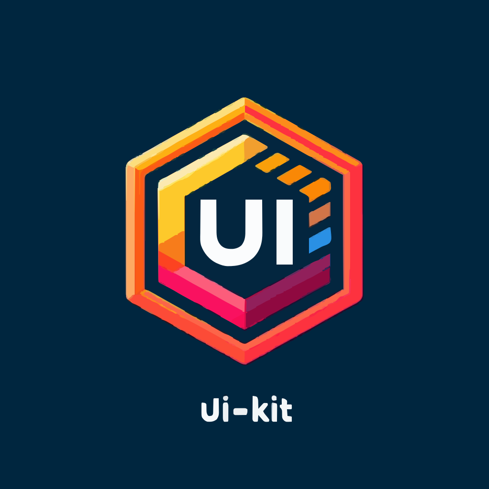

## @shortlink/ui-kit



> [!NOTE]
> The UI Kit is a collection of React components that are used in the ShortLink app.

### Installation

```bash
npm install @shortlink/ui-kit # for GitLab registry
npm install shortlink-ui-kit        # for NPM registry
```

### Usage

```jsx
import { ToggleDarkMode } from '@shortlink/ui-kit'

const App = () => {
  return <ToggleDarkMode />
}
```

### React 19 Async Patterns

See [ADR-1](./docs/adr/0001-adopt-react-19-async-patterns.md) for the architectural decision record on React 19 async patterns.

### Storybook

The UI Kit is documented with Storybook. You can run it locally with:

```bash
npm run storybook
```

### Stack

- React 19
- Pretty code base
  - Typescript
  - ESLint/Prettier
- Pretty UI
  - TailwindCSS
- Storybook (for UI)
- Jest
